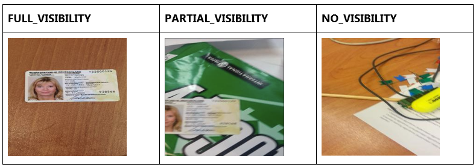
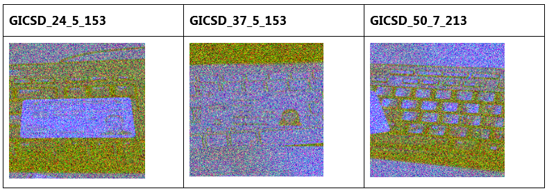

***

# ID card visibility classification

The images located inside the `data/images_raw/` directory contains images of different types of ID documents (Original dataset comes from https://arxiv.org/abs/1807.05786: MIDV-500: A Dataset for Identity Documents Analysis and Recognition on Mobile Devices in Video Stream), taken in different conditions and backgrounds. The goal is to use the images stored in this directory to train a model that classifies the visibility of the card on the photo into one of the categories: {FULL_VISIBILITY, PARTIAL_VISIBILITY, NO_VISIBILITY}.

## Background 

FULL_VISIBILITY means the card is completely shown; PARTIAL_VISIBILITY means part of the card is clipped; NO_VISIBILITY means the card does not appear in the image at all. Ground truth labels corresponding to each image under `data/images_raw/` directory is provided in `data/gicsd_labels.csv`. Each file name is formatted as GICSD_{CARD_ID}_{BACKGROUND_ID}_{IMAGE_ID}.

To understand what each visibility type means, consider the following examples (Not real examples from the challenge dataset):


Unfortunately, the camera sensor was damaged while capturing these images and the photos are corrupted, as the images below show:


## Data

data folder contains the raw input images and a csv file mapping each of these image with its ground truth label.
* `IMAGE_FILENAME`: The filename of each image, which is formatted as GICSD_{CARD_ID}_{BACKGROUND_ID}_{IMAGE_ID}
* `LABEL`: The label of each image, which can be one of these values: FULL_VISIBILITY, PARTIAL_VISIBILITY or NO_VISIBILITY. 
 

## Approach

The approach is explained in detail inside the notebook `notebooks/notebook.ipynb`. 
To recap,
* First, we performed a data exploration step where we check the consistency of images and their labels.
* We observed a quite high class imbalance between the classes.
* We randomly picked several images and for each image we split it into its RGB channels. 
* We figured out that Red and Green channels of the images were corrupted by sensor noise.
* For each image in the dataset; (i) we split it into its RGB channels, (ii) we only pick the blue-channel and saved it under `data/images_processed` directory to use for training.
* We partitioned the data based on stratified random sampling to maintain the original distribution in training/validation/testing splits.
* We set a random seed during sampling training/validation/testing images to allow reproducibility.
* Given the small scale of the dataset, we preferred to train a less complex model and used pre-trained weights from ImageNet: 
	* we trained a Resnet-18 based CNN model on the training set, and evaluated its performance on the test.
* We used precision, recall and f1-score metrics for evaluation, which are robust to high class imbalance issue.
* The results showed that CNN performed well but it was having problems recognizing PARTIAL_VISIBILITY class.

## Instructions

1. Preprocessing of all images (denoising) was performed inside the notebook `notebooks/notebook.ipynb`, and images were saved under `data/images_processed` directory.
2. Training should be run with preprocessed images. To run training, switching to the root project folder and call,

```
$ python train.py --data_csv_path data/gicsd_labels.csv \
				  --images_root_dir data/images_processed \ 
				  --artifacts_dir artifacts/
```

This runs the training and saves the model artifacts to `artifacts/` directory.

3. Prediction script can be run from the root project folder like,

```
$ python predict.py --model_path <path/to/model/checkpoint> \
					--image_path <path/to/image/file>
```

The result is printed in the console: one of FULL_VISIBILITY, PARTIAL_VISIBILITY or NO_VISIBILITY.

## Dependencies

Dependencies should be installed using `pip install -r requirements.txt`

```
pytorch-lightning==1.5.10
albumentations
pandas
scikit-learn
torchvision
fastapi
uvicorn
```

### Using Docker for development and deployment
Alternatively, one can run the training and prediction from inside a docker container. The Dockerfile provided in this repository can be run with `docker`. 

1. Run `pip install docker` in the host machine. Similarly, install docker compose in the host machine, https://docs.docker.com/compose/install/.
2. To start development docker run `./start_dev_container.sh <container_name> -b` in the project root folder. This will build a docker image and run it in the host machine. You can then connect to this container through VSCode easily if it is running in a remote host.
3. If your host is a remote server, you can ssh tunnel to your host with local port forwarding, https://www.ionos.com/digitalguide/server/security/how-to-use-ssh-tunnels/. Then, connect the jupyter notebook running inside the container through your web browser via `localhost:<forwarded_local_jupyter_port>`. Similarly `localhost:<forwarded_local_tensorboard_port>` will provide access to the tensorboard screen to monitor the model training.
4. You can start training your model by using `./train.sh` in the project root folder. The script runs with default arguments, but you can update `./train.sh`'s content if you want to run it with custom arguments.
5. You can run the deployment docker to serve your model with [fastapi](https://fastapi.tiangolo.com/). Run `./start_prod_container.sh <container_name> -b`. Similarly you can ssh tunnel to your remote host with local port forwarding. Then, connect `localhost:8000/docs` through your web browser to get access to the Swagger UI and try the prediction api by uploading an image. You can see the api returns a probability for each of the 3 visibility classes as a response.
6. It also starts a ui app built with [streamlit](https://docs.streamlit.io/), so that you can type `localhost:8501` and start uploading images to test it right away.

## Future Work

* Currently, only affine transformation is applied as data augmentation. Additional data augmentation such as brightness_contrast or horizontal flipping might improve the performance for underrepresented classes. Ideally, collecting more data from NO_VISIBILITY and PARTIAL_VISIBILITY classes would be very helpful.
* Evaluation is performed only on a single random split of the data: cross validation can be applied to obtain more reliable results.
* Different architectures can be experimented: recent "Vision Transformers" architecture computes attention between different parts of the image. This kind of approach can attend to salient regions of the image which can help in our case, i.e., it would probably attend to facial regions/corners, which might improve performance for fully or partially visible examples.
